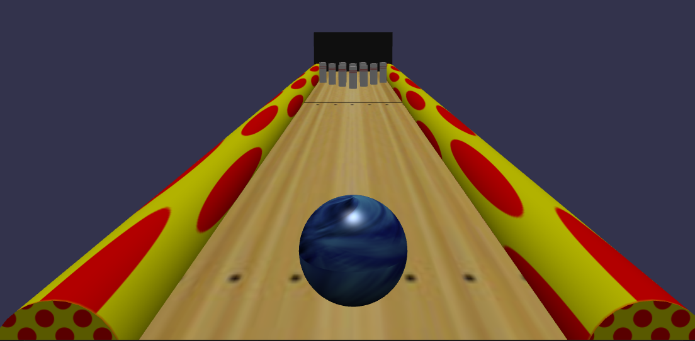

# Compte Rendu TP WebGL

BAIO David, BONNARD Guillaume, MIGUELEZ Sylvain.

## Comment faire fonctionner le projet

Avant d'ouvrir l'index dans l'explorateur, il faut exécuter la commande suivante sur un terminal afin d'avoir un affichage correct des textures:

    \$python3 -m http.server

Vous pouvez ensuite visualiser le projet en vous connectant au localhost.

Pour jouer, cliquer dans la zone de la piste afin de lancer la boule. Une fois toutes les quilles tombées, re-cliquez pour faire apparaître la fenêtre de fin.

## Choix de la technologie

Le principe de ce TP était de se familiariser avec les techniques de webGL. Le projet devait contenir les fonctionnalités suivantes:

* Gestion de la physique
* Utilisation de modèles 3D
* Gestion d'une caméra

Afin de réaliser ce projet nous avons choisi d'utiliser le framework BabylonJS. Nous avons choisi ce framework car il gère déjà lui-même une grande partie 
des fonctionnalités qui devaient être implémentées dans le projet.

## Le projet

### Présentation générale

Après avoir étudié les spécifications du projet, nous avons décidé de créé un petit jeu de bowling. Pour ce faire nous avons décidé de modéliser la piste
par un simple plan avec une texture de piste de bowling. Les quilles sont des cylindres texturés, stockées sous la forme d'un tableau. On peut voir sur l'image ci-dessous
l'aspect de la zone de jeu.

Chaque texture est gérée séparément afin de pouvoir modifier une texture en particulier assez rapidement.

### Gestion de la collision

Nous avons choisi un jeu de bowling car cela fait intervenir plusieur gestions de collision. Nous avons de la collision entre la boule et la piste, la boule et les quilles
ainsi que la boule et les barrières sur le côté. Nous avons décidé de donner une masse à la boule 10 fois supérieure à la masse des quilles. Cela nous permet d'avoir un effet
plus ou moins réaliste lorsque la boule touche les quilles. La piste, ainsi que les barrières n'ont pas de masse mais ont un coefficient de friction afin de pouvoir ralentir
la boule lors d'un contact.

Nous avons implémenté un système de score basique qui compte le nombre de quilles tombées. Un quille est considérée comme tombée si on détecte une variation de la rotation de la quille
selon l'axe x ou z supérieure à 45 degrés.

### Améliorations possibles

En l'état, le projet est plus une vitrine de démonstration technique qu'un véritable jeu.

Nous avons implémenté une sorte de score mais pour l'instant celui-ci ne compte que le nombre de quilles tombées. Nous pourrions implémenter les véritables règles du bowling, avec
la gestion des deux manches et les coups spéciaux comme le strike ou le spare. Nous pourrions aussi affiner la gestion de la collision afin d'éviter que les quilles ne partent trop
vite et trop fort, ainsi qu'un système de remise à zéro des quilles.