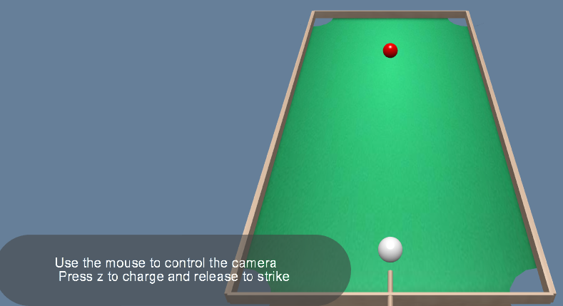
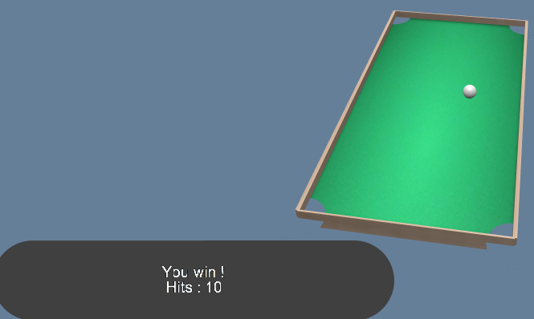
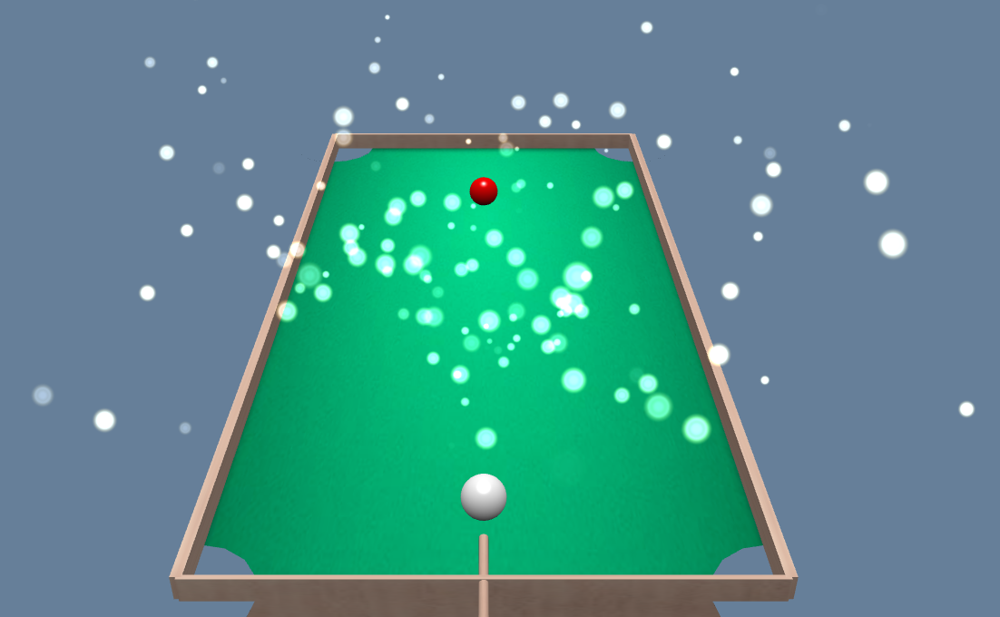

# Compte rendu de projet WebGL

Auteurs : Diana Houssami, Jacques-Marie Lesaule, Rim Qassimi

 <b> Figure 1 - Aspect général du jeu de billard. </b> 

## Introduction

Pour ce projet, nous avons choisi de développer un mini-jeu de billard simplifié avec deux boules, illustré en figure 1. L'objectif est simple : faire sortir la boule rouge par l'un des quatres trous du plateau.

## Fonctionnement du projet

Pour faire fonctionner le projet, il faut avoir accès aux textures "wood.png", "flare.png" et "texture_billard.png" ainsi qu'au code html "index.html" et au code javascript "babylon.2.4.js" issu du framework BabylonJS. 

 Le fonctionnement du jeu est simple : le joueur oriente la caméra avec les flèches directionnelles, ce qui positionne automatiqument la queue en direction de la boule blanche. Pour tirer, il faut maintenir la touche z enfoncée puis la relâcher. La vitesse de la frappe est proportionnelle à la durée pendant laquelle la touche z a été pressée. 

Lorsque le joueur fait sortir la boule rouge du plateau par l'un des trous, le joueur a gagné. Un message indique la fin de la partie et le nombre de coups réalisés, comme illustré en figure 2. Mais s'il fait rentrer la boule blanche, le joueur a perdu et un message affiche la fin de la partie. 

 <b> Figure 2 - Fin du jeu. </b> 

## Explication du code

### L'éclairage, les couleurs et les textures

Un éclairage simple est utilisé sur l'ensemble de la scène. La queue de billard et les bords du plateau sont revêtus d'une texture leur donnant l'aspect de bois. Une texture verte de billard classique est appliquée sur la partie plane du plateau du jeu. Quant aux boules, on leur a associé une couleur propre (blanche et rouge) et un aspect lisse via les couleurs diffuse et spéculaire. Lorsque le joueur maintient la touche z enfoncée pour charger son coup, la boule blanche devient rouge et retrouve progressivement sa couleur d'origine.

### Les collisions

Plusieurs types de collisions sont implémentés pour les boules :

- avec l'autre boule : les deux objets se repoussent proportionnellement à la force du coup. 
- avec les trous : la boule disparaît et une fenêtre annonce la fin du jeu
- avec les bords : la vitesse dans la direction du bord est inversée (rebond). Une variable permet d'appliquer un multiplicateur à la vitesse lors des rebonds (par défaut 1,1)

Le nombre de boules complexifie donc le code et sa visibilité. C'est pourquoi nous avons préféré utiliser seulement deux boules, tout en montrant que l'on sait comment gérer les collisions. 

  
### Les interactions joueur

 Le joueur peut interagir avec le jeu via les touches du clavier. La caméra est contrôlée à l'aide des touches directionnelles. La direction du coup est celle de l'axe caméra-boule, ce qui rend le jeu très simple à jouer en donnant toujours l'angle de vue optimal. En appuyant sur la touche z plus ou moins longtemps avant de la relâcher, le joueur peut contrôler la puissance de son coup. Avec les flèches directionnelles et la souris, il contrôle la caméra (position et orientation de la vue). Notons que la queue est purement décorative et ne peut entrer en collision avec les boules 

### Le texte explicatif des touches

 Un texte 2D est affiché en permanence sur l'écran afin d'indiquer au joueur quelles sont les touches pour jouer. Ceci est fait via une variable de type texte 2D dont le contenu est affiché en bas à gauche de l'écran.  

### Les effets de particules

 Lorsque les boules entrent en collison, un système de particule centré sur la boule blanche crée des particules. Plus le choc est violent, plus les particules générées sont nombreuses. Ceci est illustré en figure 3. 

 <b> Figure 3 - Système de particules. </b> 

